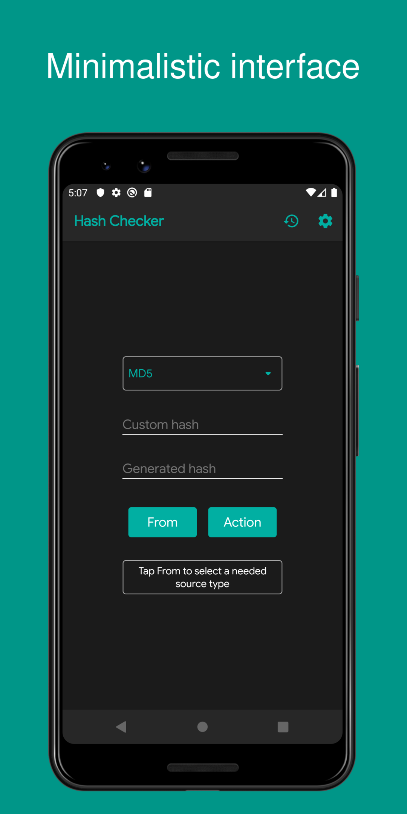
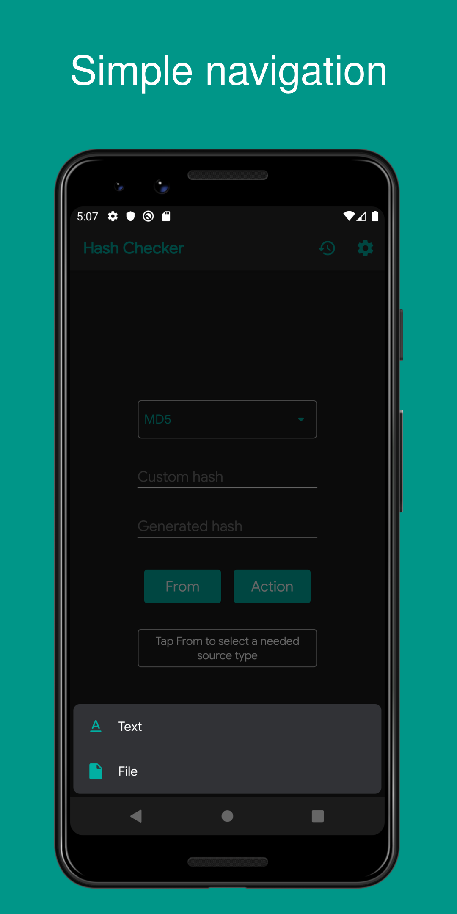
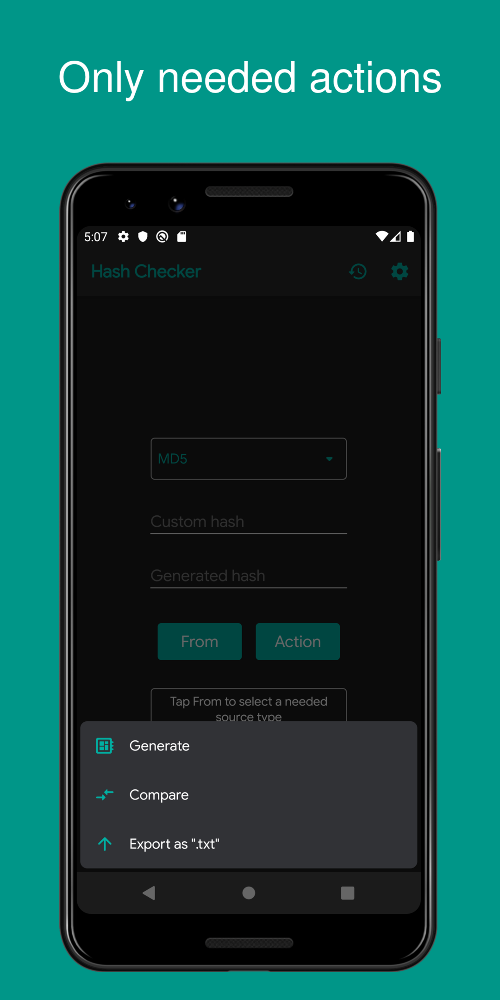
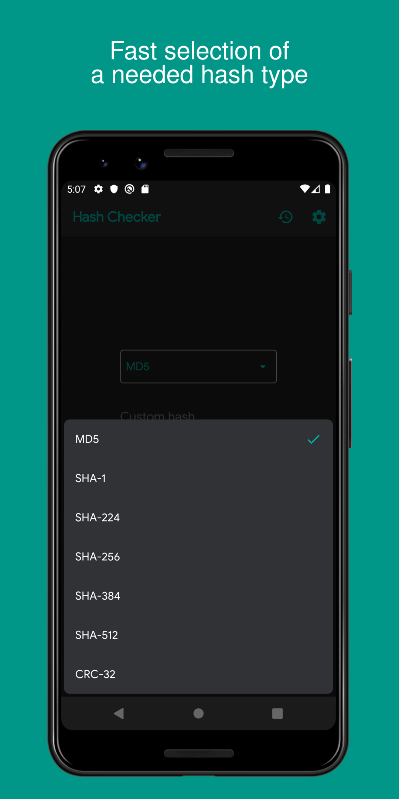
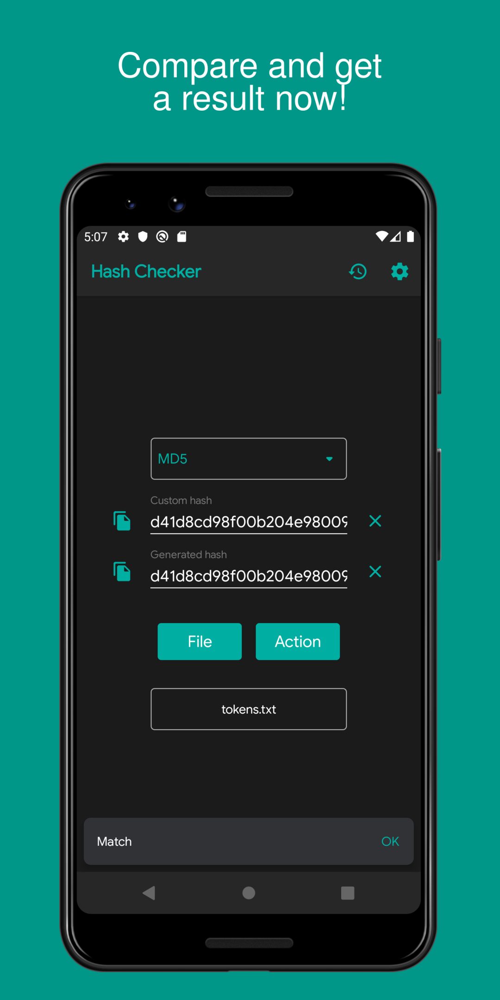

# ATTENTION

### Any political topics, as well as users who started them, are blocked forever without the right to restore access!

### This is a project repository, not a discussion platform!

# Current app state

The app is currently unsupported. You can create new [issues](https://github.com/hash-checker/hash-checker/issues) or ask me [questions](https://github.com/hash-checker/hash-checker/issues), but anything that involves making edits will at best be done by a third-party contributor. I will accept all new features and build new app versions by request.

New versions of the application will be published on all the resources listed above except Google Play. If you want download latest app version, check [GitHub Releases](https://github.com/hash-checker/hash-checker/releases) or [IzzyOnDroid](https://apt.izzysoft.de/fdroid/index/apk/com.smlnskgmail.jaman.hashchecker.thirdparty). I do not guarantee the availability of the latest versions on other sites or stores and if you find (for example) version `3.7.3` on APKPure - it's not an official publication.

# Hash Checker

Fast and simple application that allows you to generate and compare hashes from files and text.

## Download

## Supporting algorithms

| Name                                                            | Since version | Status       |
| --------------------------------------------------------------- | ------------- | ------------ |
| [MD5](https://en.wikipedia.org/wiki/MD5)                        | 1.0.0         | `Supporting` |
| [SHA-1](https://en.wikipedia.org/wiki/SHA-1)                    | 1.0.0         | `Supporting` |
| [SHA-224](https://en.wikipedia.org/wiki/SHA-2)                  | 1.4.0         | `Supporting` |
| [SHA-256](https://en.wikipedia.org/wiki/SHA-2)                  | 1.0.0         | `Supporting` |
| [SHA-384](https://en.wikipedia.org/wiki/SHA-2)                  | 1.4.0         | `Supporting` |
| [SHA-512](https://en.wikipedia.org/wiki/SHA-2)                  | 1.0.0         | `Supporting` |
| [CRC-32](https://en.wikipedia.org/wiki/Cyclic_redundancy_check) | 2.9.0         | `Supporting` |
| [SHA3-224](https://en.wikipedia.org/wiki/SHA-3)                 | 3.6.5         | `Supporting` |
| [SHA3-256](https://en.wikipedia.org/wiki/SHA-3)                 | 3.6.5         | `Supporting` |
| [SHA3-384](https://en.wikipedia.org/wiki/SHA-3)                 | 3.6.5         | `Supporting` |
| [SHA3-512](https://en.wikipedia.org/wiki/SHA-3)                 | 3.6.5         | `Supporting` |

## Screenshots

 

  
  
  
  
  

## How to use

* [H2S Media](https://www.how2shout.com/how-to/how-to-calculate-the-hash-of-a-file-or-create-custom-hash-on-android.html)

## Forums

| Forum                                                     | Language |
| --------------------------------------------------------- | -------- |
| [4PDA](https://4pda.to/forum/index.php?showtopic=1015172) | Русский  |

## Videos

* [YouTube](https://www.youtube.com/watch?v=Q7Otn971kJk&list=PLOIwDRWd_SDdBz2aiVtMocFunaXaKSPMx)

## Black Duck Open Hub

* [Hash Checker (Android)](https://www.openhub.net/p/hash-checker)

## Privacy Policy

* [Web version](https://hash-checker.github.io/hash-checker-privacy-policy.io/)

## Feedback

If you have any question or feature idea for this application, you can open an issue
on [this page](https://github.com/hash-checker/hash-checker/issues) or contact me by email
jaman.smlnsk@gmail.com.

## Contributors

<table id='team'>
<tr>
<td id='fartem'>

<h4 align='center'><a href='https://github.com/fartem'>Artem Fomchenkov</a></h4>
</td>
<td id='ManishDait'>

<h4 align='center'><a href='https://github.com/ManishDait'>Manish Dait</a></h4>
</td>
<td id='vipozdn'>

<h4 align='center'><a href='https://github.com/vipozdn'>Victor</a></h4>
</td>
<td id='Marwa-Eltayeb'>

<h4 align='center'><a href='https://github.com/Marwa-Eltayeb'>Marwa Said</a></h4>
</td>
<td id='firaja'>

<h4 align='center'><a href='https://github.com/firaja'>David Bertoldi</a></h4>
</td>
</tr>
<td id='fu7mu4'>

<h4 align='center'><a href='https://github.com/fu7mu4'>fu7mu4</a></h4>
</td>
<td id='AmrDeveloper'>

<h4 align='center'><a href='https://github.com/AmrDeveloper'>Amr Hesham</a></h4>
</td>
<td id='itamarc'>

<h4 align='center'><a href='https://github.com/itamarc'>Itamar Carvalho</a></h4>
</td>
<td id='StianVaage'>

<h4 align='center'><a href='https://github.com/StianVaage'>Stian Vaage</a></h4>
</td>
<td id='Alexandru51'>

<h4 align='center'><a href='https://github.com/Alexandru51'>Alexandru51</a></h4>
</td>
</tr>
<td id='elliotwutingfeng'>

<h4 align='center'><a href='https://github.com/elliotwutingfeng'>Wu Tingfeng</a></h4>
</td>
<td id='Abhisht01'>

<h4 align='center'><a href='https://github.com/Abhisht01'>Abhisht Dixit</a></h4>
</td>
<td id='panchal20bhavin'>

<h4 align='center'><a href='https://github.com/panchal20bhavin'>panchal20bhavin</a></h4>
</td>
<td id='vaqueraexe'>

<h4 align='center'><a href='https://github.com/vaqueraexe'>Sergio Amaya</a></h4>
</td>
</table>

## Special thanks

* [@IzzySoft](https://github.com/IzzySoft) as Izzy for uploading the app
  to [IzzySoft Apt Repositories](https://apt.izzysoft.de)
* [@lexterror](https://github.com/lexterror) as mrrmx for useful feature requests
